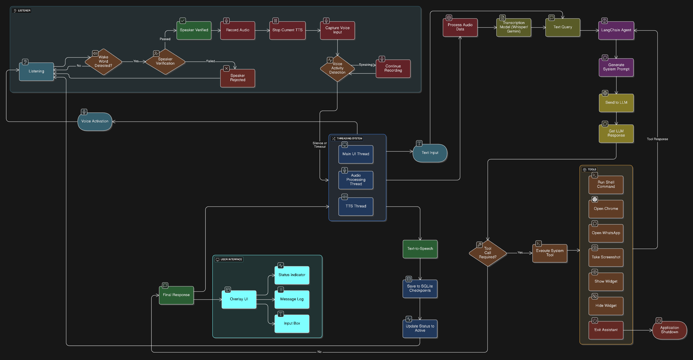

# DesktopAI Assistant 🤖

An intelligent, voice-activated AI assistant for Linux desktop environments that combines advanced AI capabilities with seamless system integration. Built with modern technologies including LangChain, Groq API, and PyQt5 for a responsive and intuitive user experience.


## 🌟 Key Features

### 🎤 Advanced Voice Processing
- **Wake Word Detection**: Responds to "Jasper" using Porcupine wake word engine
- **Speaker Verification**: Uses Resemblyzer for owner voice recognition and security
- **Voice Activity Detection**: Intelligent speech detection with Silero VAD
- **High-Quality Speech Recognition**: Groq Whisper API for accurate transcription

### 🧠 AI-Powered Intelligence
- **LangChain Integration**: Advanced conversational AI with tool usage capabilities
- **Multiple LLM Support**: Compatible with Groq, Anthropic, and other providers
- **Conversation Memory**: Persistent chat history with SQLite checkpoints
- **Context Summarization**: Automatic conversation summarization for long interactions
- **Intelligent Tool Selection**: React agent that chooses appropriate tools automatically

### 🖥️ System Integration
- **Shell Command Execution**: Run any Linux command via voice
- **Browser Control**: Open Chrome with specific URLs or in new windows
- **Application Launching**: Quick access to WhatsApp Web and other applications
- **Screenshot Capabilities**: Take and analyze screen captures
- **System Monitoring**: Real-time status updates and logging

### 🎨 Modern User Interface
- **Transparent Overlay**: PyQt5-based floating window with transparency
- **Real-time Status**: Visual indicators for listening, processing, and responding states
- **Message History**: Scrollable conversation log with user/assistant distinction
- **Text Input**: Alternative text-based interaction alongside voice
- **Draggable Interface**: Repositionable overlay window

### 🔧 Advanced Configuration
- **Modular Architecture**: Clean separation of concerns with organized components
- **Thread-Safe Operations**: Concurrent processing for responsive performance
- **Comprehensive Logging**: Detailed logs for debugging and monitoring
- **Environment-Based Config**: Flexible configuration via environment variables

## 🏗️ Architecture Overview


## 📋 Prerequisites

### System Requirements
- **Operating System**: Linux (tested on Arch Linux, Ubuntu, Fedora)
- **Python**: 3.8 or higher
- **Audio**: Working microphone and speakers/headphones
- **Display**: X11 or Wayland with Qt support

### API Requirements
- **Groq API Key**: For Whisper transcription and LLM inference
- **Porcupine Access Key**: For wake word detection (free tier available)

### Optional APIs
- **Anthropic API Key**: Alternative LLM provider
- **Google API Key**: For additional services (if needed)

## 🚀 Installation

### 1. Clone the Repository

```bash
git clone https://github.com/Harshbansal8705/DesktopAI.git
cd DesktopAI
```

### 2. Set Up Python Environment

```bash
# Create virtual environment
python -m venv venv

# Activate virtual environment
source venv/bin/activate
```

### 3. Install Dependencies

```bash
pip install -r requirements.txt
```

### 4. Configure Environment Variables

Rename .env.sample to .env and add your API keys.

### 5. Set Up Owner Voice Recognition

```bash
# Record your voice for speaker verification
python setup/record_owner_voice.py
```

Follow the prompts to record 20 seconds of your voice. This creates a voice profile for security.

### 6. Make Run Script Executable

```bash
chmod +x run.sh
```

## 🎯 Usage

### Starting the Assistant

```bash
# Using the run script (recommended)
./run.sh

# Or manually
source venv/bin/activate
QT_QPA_PLATFORM=xcb python main.py
```

### Voice Interaction

1. **Wake Up**: Say "Jasper" clearly
2. **Wait for Confirmation**: Listen for the start sound
3. **Speak Your Command**: Give your instruction naturally
4. **Listen for Response**: Desktop Assistant will respond with both voice and text

### Example Commands

```
"Jasper, what's the current time?"
"Jasper, open Chrome and go to GitHub"
"Jasper, run ls -la in the terminal"
"Jasper, take a screenshot"
"Jasper, open WhatsApp Web"
"Jasper, what's the weather today?"
"Jasper, help me write a Python script"
```

### Text Interaction

- Use the text input box in the overlay for silent interaction
- Type your message and press Enter or click Send
- Useful in quiet environments or when microphone is unavailable

## 🛠️ Available Tools

### System Commands
- **run_command**: Execute any shell command on your Linux system
- **get_screenshot**: Capture and analyze current screen content

### Application Control
- **open_google_chrome**: Launch Chrome browser with optional URL
- **open_whatsapp_web**: Open WhatsApp Web application

### Interface Control
- **show_popup_widget**: Display the overlay interface
- **hide_popup_widget**: Hide the overlay interface
- **exit_assistant**: Safely shutdown the assistant

### Utility Functions
- **do_nothing**: No-operation function for when no action is needed

## 📁 Project Structure

```
DesktopAI/
├── main.py                         # Application entry point
├── run.sh                          # Startup script
├── requirements.txt                # Python dependencies
├── LICENSE                         # MIT license
├── README.md                       # This documentation
│
├── src/                            # Source code directory
│   ├── __init__.py
│   ├── config.py                   # Configuration management
│   │
│   ├── core/                       # Core AI components
│   │   ├── __init__.py
│   │   ├── assistant.py            # Main LangChain agent
│   │   ├── llm.py                  # LLM provider setup
│   │   ├── generate_prompt.py      # System prompt generation
│   │   ├── summarizer.py           # Conversation summarization
│   │   └── tools.py                # System integration tools
│   │
│   ├── audio/                      # Audio processing components
│   │   ├── __init__.py
│   │   ├── listener.py             # Voice listener with wake word
│   │   ├── vad.py                  # Voice activity detection
│   │   ├── audio_processor.py      # Audio transcription
│   │   ├── ttsplayer.py            # Text-to-speech
│   │   └── voice_input_handler.py  # Complete voice pipeline
│   │
│   ├── ui/                         # User interface components
│   │   ├── __init__.py
│   │   └── overlay.py              # PyQt5 transparent overlay
│   │
│   └── utils/                      # Utility modules
│       ├── __init__.py
│       ├── logger.py               # Logging configuration
│       └── thread_executor.py      # Thread pool management
│
├── setup/                          # Setup and configuration scripts
│   └── record_owner_voice.py       # Voice profile recording
│
├── data/                           # Data files
│   ├── owner.wav                   # Owner voice profile (created)
│   └── soundeffects/               # Audio feedback sounds
│       ├── start_recording.mp3
│       └── stop_recording.mp3
│
├── wakewordmodels/                 # Wake word detection models
│   └── Jasper_en_linux_v3_0_0.ppn
│
├── logs/                           # Application logs (created)
└── checkpoints/                    # Conversation memory (created)
```

## ⚙️ Configuration

### Audio Settings
```python
# Audio configuration in src/config.py
SAMPLE_RATE = 16000              # Audio sample rate
CHANNELS = 1                     # Mono audio
CONFIDENCE_THRESHOLD = 0.5       # VAD sensitivity
MAX_SILENCE_FRAMES = 60          # Stop recording after silence
SPEAKER_SIMILARITY_THRESHOLD = 0.6 # Voice verification threshold
```

### LLM Configuration
```python
# LLM settings
LLM_MODEL = "meta-llama/llama-4-scout-17b-16e-instruct"
LLM_PROVIDER = "groq"
LLM_TEMPERATURE = 0.8
MAX_TOKENS_HISTORY = 10000
```

### UI Configuration
```python
# Interface settings
OVERLAY_WIDTH = 400
OVERLAY_HEIGHT = 200
OVERLAY_X = 50                   # Default position
OVERLAY_Y = 50
MESSAGE_TIMEOUT = 5              # Auto-hide timeout
```

## 🚀 Advanced Usage

### Custom Tools

Add new tools by editing `src/core/tools.py`:

```python
@tool
def my_custom_tool(parameter: str) -> str:
    """Description of what this tool does."""
    # Your implementation here
    return "Tool result"

# Register in assistant.py
agent = create_react_agent(
    model=model,
    tools=[
        # existing tools...
        my_custom_tool,
    ],
    # other parameters...
)
```

### Custom LLM Providers

Modify `src/core/llm.py` to use different providers:

```python
from langchain.chat_models import init_chat_model

model = init_chat_model(
    model="your-model-name",
    model_provider="your-provider",
    api_key="your-api-key",
    # additional parameters...
)
```

### Conversation Customization

Edit the system prompt in `src/core/generate_prompt.py`:

```python
system_msg = f"""
You are **YourAssistantName**, a custom AI assistant...
# Customize personality, capabilities, and behavior
"""
```

## 📝 License

This project is licensed under the MIT License - see the [LICENSE](LICENSE) file for details.

## 🙏 Acknowledgments

- **Porcupine** by Picovoice for wake word detection
- **Groq** for fast LLM inference and Whisper API
- **LangChain** for AI agent framework
- **PyQt5** for the user interface
- **Edge TTS** for text-to-speech synthesis
- **Resemblyzer** for speaker verification

## 📞 Support

For issues, questions, or contributions:

- **GitHub Issues**: [Report bugs or request features](https://github.com/Harshbansal8705/DesktopAI/issues)
- **Email**: harsh@harshbansal.in

---

**Made with ❤️ by Harsh Bansal**
