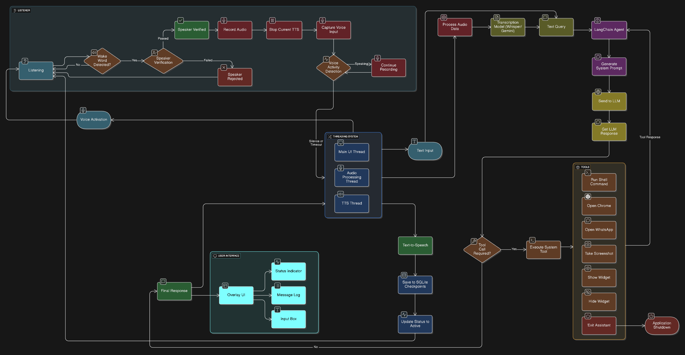

# DesktopAI Assistant 🤖

An intelligent, voice-activated AI assistant for Linux desktop environments that combines advanced AI capabilities with seamless system integration. Built with modern technologies including LangChain, Groq API, and PyQt5 for a responsive and intuitive user experience.


## 🌟 Key Features

### 🎤 Advanced Voice Processing
- **Wake Word Detection**: Responds to "Jasper" using Porcupine wake word engine
- **Speaker Verification**: Uses Resemblyzer for owner voice recognition and security
- **Voice Activity Detection**: Intelligent speech detection with Silero VAD
- **High-Quality Speech Recognition**: Groq Whisper API for accurate transcription

### 🧠 AI-Powered Intelligence
- **LangChain Integration**: Advanced conversational AI with tool usage capabilities
- **Multiple LLM Support**: Compatible with Groq, Anthropic, and other providers
- **Conversation Memory**: Persistent chat history with SQLite checkpoints
- **Context Summarization**: Automatic conversation summarization for long interactions
- **Intelligent Tool Selection**: React agent that chooses appropriate tools automatically

### 🖥️ System Integration
- **Shell Command Execution**: Run any Linux command via voice
- **Browser Control**: Open Chrome with specific URLs or in new windows
- **Application Launching**: Quick access to web applications
- **Screenshot Capabilities**: Take and analyze screen captures
- **System Monitoring**: Real-time status updates and logging

### 🎨 Modern User Interface
- **Transparent Overlay**: PyQt5-based floating window with transparency
- **Real-time Status**: Visual indicators for listening, processing, and responding states
- **Message History**: Scrollable conversation log with user/assistant distinction
- **Text Input**: Alternative text-based interaction alongside voice
- **Draggable Interface**: Repositionable overlay window

### 🔧 Advanced Configuration
- **Modular Architecture**: Clean separation of concerns with organized components
- **Thread-Safe Operations**: Concurrent processing for responsive performance
- **Comprehensive Logging**: Detailed logs for debugging and monitoring
- **Environment-Based Config**: Flexible configuration via environment variables
- **Personalizable**: Customize the assistant's name and personality via config

## 🏗️ Architecture Overview


## 📋 Prerequisites

### System Requirements
- **Operating System**: Linux (tested on Arch Linux, Ubuntu, Fedora)
- **Python**: 3.8 or higher
- **Audio**: Working microphone and speakers/headphones
- **Display**: X11 or Wayland with Qt support

### API Requirements
- **Groq API Key**: For Whisper transcription and LLM inference
- **Porcupine Access Key**: For wake word detection (free tier available)

### Optional APIs
- **Anthropic API Key**: Alternative LLM provider
- **Google API Key**: For additional services (if needed)
- **Tavily API Key**: For web search functionality

## 🚀 Installation

### 1. Clone the Repository

```bash
git clone https://github.com/Harshbansal8705/DesktopAI.git
cd DesktopAI
```

### 2. Set Up Python Environment

```bash
# Create virtual environment
python -m venv venv

# Activate virtual environment
source venv/bin/activate
```

### 3. Install Dependencies

```bash
pip install -r requirements.txt
```

### 4. Configure Environment Variables

```bash
cp .env.example .env
```

Edit `.env` and add your API keys. At minimum you'll need `GROQ_API_KEY` and `PORCUPINE_ACCESS_KEY`. You can also customize the assistant by setting the personalization fields (`ASSISTANT_NAME`, `OWNER_NAME`, etc.).

### 5. Set Up Owner Voice Recognition

```bash
# Record your voice for speaker verification
python setup/record_owner_voice.py
```

Follow the prompts to record 20 seconds of your voice. This creates a voice profile for security.

### 6. Make Run Script Executable

```bash
chmod +x run.sh
```

## 🎯 Usage

### Starting the Assistant

```bash
# Using the run script (recommended)
./run.sh

# Or manually
source venv/bin/activate
QT_QPA_PLATFORM=xcb python main.py
```

### Voice Interaction

1. **Wake Up**: Say "Jasper" clearly
2. **Wait for Confirmation**: Listen for the start sound
3. **Speak Your Command**: Give your instruction naturally
4. **Listen for Response**: Desktop Assistant will respond with both voice and text

### Example Commands

```
"Jasper, what's the current time?"
"Jasper, open Chrome and go to GitHub"
"Jasper, run ls -la in the terminal"
"Jasper, take a screenshot"
"Jasper, what's the weather today?"
"Jasper, help me write a Python script"
```

### Text Interaction

- Use the text input box in the overlay for silent interaction
- Type your message and press Enter or click Send
- Useful in quiet environments or when microphone is unavailable

## 🛠️ Available Tools

### System Commands
- **run_command**: Execute any shell command on your Linux system
- **get_screenshot**: Capture and analyze current screen content

### Application Control
- **open_google_chrome**: Launch Chrome browser with optional URL
- **open_whatsapp_web**: Open WhatsApp Web application

### Interface Control
- **show_popup_widget**: Display the overlay interface
- **hide_popup_widget**: Hide the overlay interface
- **exit_assistant**: Safely shutdown the assistant

### Web & Search
- **web_search**: Search the web using Tavily API

### Mobile Integration (requires ADB)
- **mirror_mobile**: Mirror mobile screen or camera via scrcpy
- **get_location**: Get location from connected Android device

### Utility Functions
- **do_nothing**: No-operation function for when no action is needed

## 📁 Project Structure

```
DesktopAI/
├── main.py                         # Application entry point
├── run.sh                          # Startup script
├── requirements.txt                # Python dependencies
├── LICENSE                         # MIT license
├── README.md                       # This documentation
├── CONTRIBUTING.md                 # Contribution guidelines
├── CODE_OF_CONDUCT.md              # Community code of conduct
│
├── src/                            # Source code directory
│   ├── __init__.py
│   ├── config.py                   # Configuration management
│   │
│   ├── core/                       # Core AI components
│   │   ├── __init__.py
│   │   ├── assistant.py            # Main LangChain agent
│   │   ├── llm.py                  # LLM provider setup
│   │   ├── generate_prompt.py      # System prompt generation
│   │   ├── summarizer.py           # Conversation summarization
│   │   └── tools.py                # System integration tools
│   │
│   ├── audio/                      # Audio processing components
│   │   ├── __init__.py
│   │   ├── listener.py             # Voice listener with wake word
│   │   ├── vad.py                  # Voice activity detection (standalone, future use)
│   │   ├── audio_processor.py      # Audio transcription
│   │   └── ttsplayer.py            # Text-to-speech
│   │
│   ├── ui/                         # User interface components
│   │   ├── __init__.py
│   │   └── overlay.py              # PyQt5 transparent overlay
│   │
│   └── utils/                      # Utility modules
│       ├── __init__.py
│       ├── logger.py               # Logging configuration
│       └── thread_executor.py      # Thread pool management
│
├── setup/                          # Setup and configuration scripts
│   └── record_owner_voice.py       # Voice profile recording
│
├── data/                           # Data files
│   ├── owner.wav                   # Owner voice profile (created during setup)
│   └── soundeffects/               # Audio feedback sounds
│       ├── start_recording.mp3
│       └── stop_recording.mp3
│
├── wakewordmodels/                 # Wake word detection models
│   └── Jasper_en_linux_v3_0_0.ppn
│
├── .github/                        # GitHub templates and workflows
│   ├── ISSUE_TEMPLATE/
│   │   ├── bug_report.md
│   │   └── feature_request.md
│   ├── PULL_REQUEST_TEMPLATE.md
│   └── workflows/
│       └── lint.yml
│
├── logs/                           # Application logs (created at runtime)
└── checkpoints/                    # Conversation memory (created at runtime)
```

## ⚙️ Configuration

All configuration is managed through environment variables (`.env` file) and `src/config.py`.

### Personalization
```bash
# In your .env file
ASSISTANT_NAME="Jasper"        # Your assistant's name
OWNER_NAME="Your Name"         # Your name
OWNER_AGE="25"                 # Your age (optional)
OWNER_LOCATION="India"         # Your location (optional)
OWNER_OCCUPATION="Student"     # Your occupation (optional)
OWNER_COLLEGE="MIT"            # Your college (optional)
OWNER_INTERESTS="AI, Music"    # Your interests (optional)
```

### Audio Settings
```python
# Audio configuration in src/config.py
SAMPLE_RATE = 16000              # Audio sample rate
CHANNELS = 1                     # Mono audio
CONFIDENCE_THRESHOLD = 0.5       # VAD sensitivity
MAX_SILENCE_FRAMES = 60          # Stop recording after silence
SPEAKER_SIMILARITY_THRESHOLD = 0.6 # Voice verification threshold
```

### LLM Configuration
```bash
# In your .env file (or defaults in config.py)
LLM_MODEL="meta-llama/llama-4-scout-17b-16e-instruct"
LLM_PROVIDER="groq"
LLM_TEMPERATURE=0.8
```

### UI Configuration
```python
# Interface settings in src/config.py
OVERLAY_WIDTH = 400
OVERLAY_HEIGHT = 200
OVERLAY_X = 50                   # Default position
OVERLAY_Y = 50
MESSAGE_TIMEOUT = 5              # Auto-hide timeout
```

## 🚀 Advanced Usage

### Custom Tools

Add new tools by editing `src/core/tools.py`:

```python
@tool
def my_custom_tool(parameter: str) -> str:
    """Description of what this tool does."""
    # Your implementation here
    return "Tool result"
```

The `@tool` decorator automatically registers and adds logging to your tool. See [CONTRIBUTING.md](CONTRIBUTING.md) for more details.

### Custom LLM Providers

Set environment variables to use different providers:

```bash
LLM_MODEL="your-model-name"
LLM_PROVIDER="your-provider"
```

Or modify `src/core/llm.py` directly for more control.

## 🤝 Contributing

We welcome contributions! Whether it's bug reports, feature requests, or code contributions, every bit helps.

Please read our [Contributing Guide](CONTRIBUTING.md) before submitting a PR.

See the [open issues](https://github.com/HarshBansal8705/DesktopAI/issues) for a list of known issues and planned features.

## 📜 Code of Conduct

This project follows the [Contributor Covenant Code of Conduct](CODE_OF_CONDUCT.md). By participating, you are expected to uphold this code.

## 📝 License

This project is licensed under the MIT License - see the [LICENSE](LICENSE) file for details.

## 🙏 Acknowledgments

- **Porcupine** by Picovoice for wake word detection
- **Groq** for fast LLM inference and Whisper API
- **LangChain** for AI agent framework
- **PyQt5** for the user interface
- **Edge TTS** for text-to-speech synthesis
- **Resemblyzer** for speaker verification

## 📞 Support

For issues, questions, or contributions:

- **GitHub Issues**: [Report bugs or request features](https://github.com/Harshbansal8705/DesktopAI/issues)
- **Email**: harsh@harshbansal.in

---

**Made with ❤️ by Harsh Bansal**
